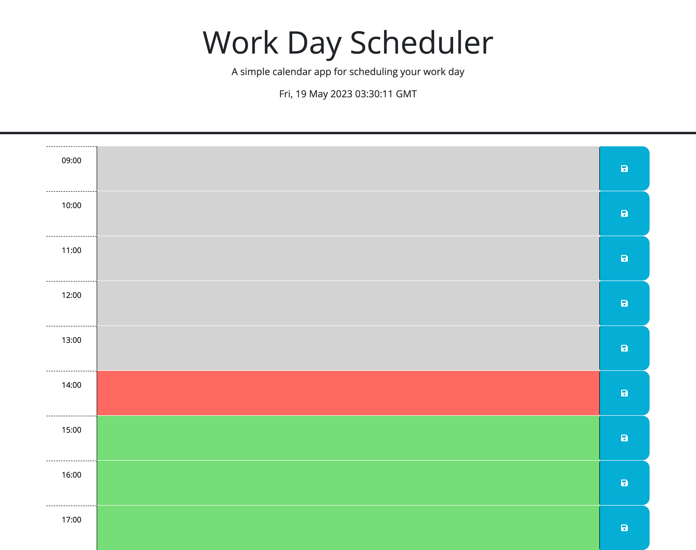

# Daily Planner

## Description

The daily planner webpage is designed for a user to log all of their projects to do during their workday. They can add project description in the time slot when they need to be done. The colors change based on the time of day to signify if the project needs to be done within the hour, past due, or they have time before it is due.

The goal of this project was to add functionality to the website so that the user can add information about their projects and at what time and that information is stored in their local storage. I added the color changing functionality too so that it changes based on the time of day. I also added the current date at the top for the users benefit. 

In this project I learned more about local storage and utilizing jquery. Specifically I learned more about the .this tag, referring to the current object which makes DOM traversal easier. I used dayjs to get the time of day and used a conditional for the color changing aspect. 

## Resources

[Deployed Site](https://cdgonzo23.github.io/daily-planner/)

[Repository](https://github.com/cdgonzo23/daily-planner)

### ScreenShots
